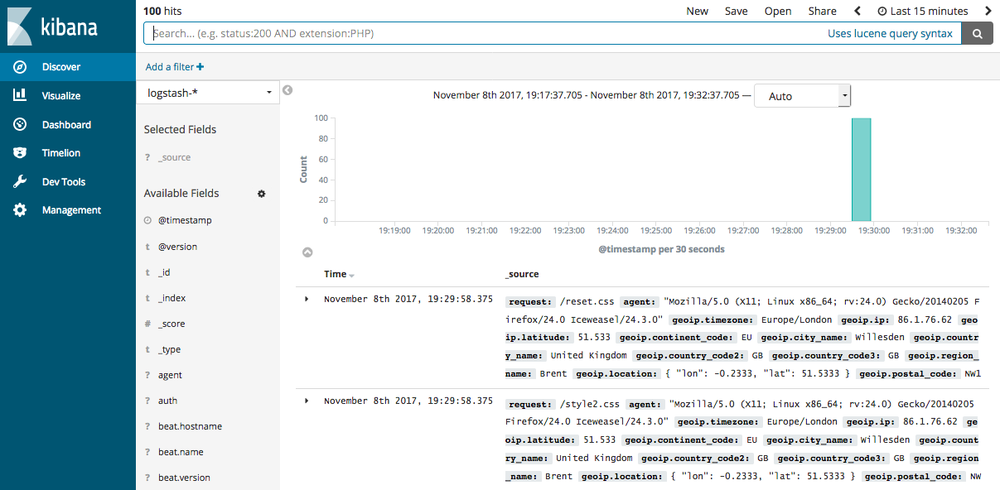

---
mapped_pages:
  - https://www.elastic.co/guide/en/logstash/current/advanced-pipeline.html
---

# Parsing Logs with Logstash [advanced-pipeline]

In [Stashing Your First Event](/reference/first-event.md), you created a basic Logstash pipeline to test your Logstash setup. In the real world, a Logstash pipeline is a bit more complex: it typically has one or more input, filter, and output plugins.

In this section, you create a Logstash pipeline that uses Filebeat to take Apache web logs as input, parses those logs to create specific, named fields from the logs, and writes the parsed data to an Elasticsearch cluster. Rather than defining the pipeline configuration at the command line, you’ll define the pipeline in a config file.

To get started, go [here](https://download.elastic.co/demos/logstash/gettingstarted/logstash-tutorial.log.gz) to download the sample data set used in this example. Unpack the file.

## Configuring Filebeat to Send Log Lines to Logstash [configuring-filebeat]

Before you create the Logstash pipeline, you’ll configure Filebeat to send log lines to Logstash. The [Filebeat](https://github.com/elastic/beats/tree/main/filebeat) client is a lightweight, resource-friendly tool that collects logs from files on the server and forwards these logs to your Logstash instance for processing. Filebeat is designed for reliability and low latency. Filebeat has a light resource footprint on the host machine, and the [`Beats input`](logstash-docs-md://lsr/plugins-inputs-beats.md) plugin minimizes the resource demands on the Logstash instance.

::::{note}
In a typical use case, Filebeat runs on a separate machine from the machine running your Logstash instance. For the purposes of this tutorial, Logstash and Filebeat are running on the same machine.
::::


The default Logstash installation includes the [`Beats input`](logstash-docs-md://lsr/plugins-inputs-beats.md) plugin. The Beats input plugin enables Logstash to receive events from the Elastic Beats framework, which means that any Beat written to work with the Beats framework, such as Packetbeat and Metricbeat, can also send event data to Logstash.

To install Filebeat on your data source machine, download the appropriate package from the Filebeat [product page](https://www.elastic.co/downloads/beats/filebeat). You can also refer to [Filebeat quick start](beats://reference/filebeat/filebeat-installation-configuration.md) for additional installation instructions.

After installing Filebeat, you need to configure it. Open the `filebeat.yml` file located in your Filebeat installation directory, and replace the contents with the following lines. Make sure `paths` points to the example Apache log file, `logstash-tutorial.log`, that you downloaded earlier:

```yaml
filebeat.inputs:
- type: log
  paths:
    - /path/to/file/logstash-tutorial.log <1>
output.logstash:
  hosts: ["localhost:5044"]
```

1. Absolute path to the file or files that Filebeat processes.


Save your changes.

To keep the configuration simple, you won’t specify TLS/SSL settings as you would in a real world scenario.

At the data source machine, run Filebeat with the following command:

```shell
sudo ./filebeat -e -c filebeat.yml -d "publish"
```

::::{note}
If you run Filebeat as root, you need to change ownership of the configuration file (see [Config File Ownership and Permissions](beats://reference/libbeat/config-file-permissions.md) in the *Beats Platform Reference*).
::::


Filebeat will attempt to connect on port 5044. Until Logstash starts with an active Beats plugin, there won’t be any answer on that port, so any messages you see regarding failure to connect on that port are normal for now.


## Configuring Logstash for Filebeat Input [_configuring_logstash_for_filebeat_input]

Next, you create a Logstash configuration pipeline that uses the Beats input plugin to receive events from Beats.

The following text represents the skeleton of a configuration pipeline:

```json
# The # character at the beginning of a line indicates a comment. Use
# comments to describe your configuration.
input {
}
# The filter part of this file is commented out to indicate that it is
# optional.
# filter {
#
# }
output {
}
```

This skeleton is non-functional, because the input and output sections don’t have any valid options defined.

To get started, copy and paste the skeleton configuration pipeline into a file named `first-pipeline.conf` in your home Logstash directory.

Next, configure your Logstash instance to use the Beats input plugin by adding the following lines to the `input` section of the `first-pipeline.conf` file:

```json
    beats {
        port => "5044"
    }
```

You’ll configure Logstash to write to Elasticsearch later. For now, you can add the following line to the `output` section so that the output is printed to stdout when you run Logstash:

```json
    stdout { codec => rubydebug }
```

When you’re done, the contents of `first-pipeline.conf` should look like this:

```json
input {
    beats {
        port => "5044"
    }
}
# The filter part of this file is commented out to indicate that it is
# optional.
# filter {
#
# }
output {
    stdout { codec => rubydebug }
}
```

To verify your configuration, run the following command:

```shell
bin/logstash -f first-pipeline.conf --config.test_and_exit
```

The `--config.test_and_exit` option parses your configuration file and reports any errors.

If the configuration file passes the configuration test, start Logstash with the following command:

```shell
bin/logstash -f first-pipeline.conf --config.reload.automatic
```

The `--config.reload.automatic` option enables automatic config reloading so that you don’t have to stop and restart Logstash every time you modify the configuration file.

As Logstash starts up, you might see one or more warning messages about Logstash ignoring the `pipelines.yml` file. You can safely ignore this warning. The `pipelines.yml` file is used for running [multiple pipelines](/reference/multiple-pipelines.md) in a single Logstash instance. For the examples shown here, you are running a single pipeline.

If your pipeline is working correctly, you should see a series of events like the following written to the console:

```json
{
    "@timestamp" => 2017-11-09T01:44:20.071Z,
        "offset" => 325,
      "@version" => "1",
          "beat" => {
            "name" => "My-MacBook-Pro.local",
        "hostname" => "My-MacBook-Pro.local",
         "version" => "6.0.0"
    },
          "host" => "My-MacBook-Pro.local",
    "prospector" => {
        "type" => "log"
    },
    "input" => {
        "type" => "log"
    },
        "source" => "/path/to/file/logstash-tutorial.log",
       "message" => "83.149.9.216 - - [04/Jan/2015:05:13:42 +0000] \"GET /presentations/logstash-monitorama-2013/images/kibana-search.png HTTP/1.1\" 200 203023 \"http://semicomplete.com/presentations/logstash-monitorama-2013/\" \"Mozilla/5.0 (Macintosh; Intel Mac OS X 10_9_1) AppleWebKit/537.36 (KHTML, like Gecko) Chrome/32.0.1700.77 Safari/537.36\"",
          "tags" => [
        [0] "beats_input_codec_plain_applied"
    ]
}
...
```


### Parsing Web Logs with the Grok Filter Plugin [configuring-grok-filter]

Now you have a working pipeline that reads log lines from Filebeat. However you’ll notice that the format of the log messages is not ideal. You want to parse the log messages to create specific, named fields from the logs. To do this, you’ll use the `grok` filter plugin.

The [`grok`](logstash-docs-md://lsr/plugins-filters-grok.md) filter plugin is one of several plugins that are available by default in Logstash. For details on how to manage Logstash plugins, see the [reference documentation](/reference/working-with-plugins.md) for the plugin manager.

The `grok` filter plugin enables you to parse the unstructured log data into something structured and queryable.

Because the `grok` filter plugin looks for patterns in the incoming log data, configuring the plugin requires you to make decisions about how to identify the patterns that are of interest to your use case. A representative line from the web server log sample looks like this:

```shell
83.149.9.216 - - [04/Jan/2015:05:13:42 +0000] "GET /presentations/logstash-monitorama-2013/images/kibana-search.png
HTTP/1.1" 200 203023 "http://semicomplete.com/presentations/logstash-monitorama-2013/" "Mozilla/5.0 (Macintosh; Intel
Mac OS X 10_9_1) AppleWebKit/537.36 (KHTML, like Gecko) Chrome/32.0.1700.77 Safari/537.36"
```

The IP address at the beginning of the line is easy to identify, as is the timestamp in brackets. To parse the data, you can use the `%{{COMBINEDAPACHELOG}}` grok pattern, which structures lines from the Apache log using the following schema:

**Information**
:   **Field Name**

IP Address
:   `clientip`

User ID
:   `ident`

User Authentication
:   `auth`

timestamp
:   `timestamp`

HTTP Verb
:   `verb`

Request body
:   `request`

HTTP Version
:   `httpversion`

HTTP Status Code
:   `response`

Bytes served
:   `bytes`

Referrer URL
:   `referrer`

User agent
:   `agent`

::::{tip}
If you need help building grok patterns, try out the [Grok Debugger](docs-content://explore-analyze/query-filter/tools/grok-debugger.md). The Grok Debugger is an {{xpack}} feature under the Basic License and is therefore **free to use**.
::::


Edit the `first-pipeline.conf` file and replace the entire `filter` section with the following text:

```json
filter {
    grok {
        match => { "message" => "%{COMBINEDAPACHELOG}"}
    }
}
```

When you’re done, the contents of `first-pipeline.conf` should look like this:

```json
input {
    beats {
        port => "5044"
    }
}
filter {
    grok {
        match => { "message" => "%{COMBINEDAPACHELOG}"}
    }
}
output {
    stdout { codec => rubydebug }
}
```

Save your changes. Because you’ve enabled automatic config reloading, you don’t have to restart Logstash to pick up your changes. However, you do need to force Filebeat to read the log file from scratch. To do this, go to the terminal window where Filebeat is running and press Ctrl+C to shut down Filebeat. Then delete the Filebeat registry file. For example, run:

```shell
sudo rm data/registry
```

Since Filebeat stores the state of each file it harvests in the registry, deleting the registry file forces Filebeat to read all the files it’s harvesting from scratch.

Next, restart Filebeat with the following command:

```shell
sudo ./filebeat -e -c filebeat.yml -d "publish"
```

There might be a slight delay before Filebeat begins processing events if it needs to wait for Logstash to reload the config file.

After Logstash applies the grok pattern, the events will have the following JSON representation:

```json
{
        "request" => "/presentations/logstash-monitorama-2013/images/kibana-search.png",
          "agent" => "\"Mozilla/5.0 (Macintosh; Intel Mac OS X 10_9_1) AppleWebKit/537.36 (KHTML, like Gecko) Chrome/32.0.1700.77 Safari/537.36\"",
         "offset" => 325,
           "auth" => "-",
          "ident" => "-",
           "verb" => "GET",
     "prospector" => {
        "type" => "log"
    },
     "input" => {
        "type" => "log"
    },
         "source" => "/path/to/file/logstash-tutorial.log",
        "message" => "83.149.9.216 - - [04/Jan/2015:05:13:42 +0000] \"GET /presentations/logstash-monitorama-2013/images/kibana-search.png HTTP/1.1\" 200 203023 \"http://semicomplete.com/presentations/logstash-monitorama-2013/\" \"Mozilla/5.0 (Macintosh; Intel Mac OS X 10_9_1) AppleWebKit/537.36 (KHTML, like Gecko) Chrome/32.0.1700.77 Safari/537.36\"",
           "tags" => [
        [0] "beats_input_codec_plain_applied"
    ],
       "referrer" => "\"http://semicomplete.com/presentations/logstash-monitorama-2013/\"",
     "@timestamp" => 2017-11-09T02:51:12.416Z,
       "response" => "200",
          "bytes" => "203023",
       "clientip" => "83.149.9.216",
       "@version" => "1",
           "beat" => {
            "name" => "My-MacBook-Pro.local",
        "hostname" => "My-MacBook-Pro.local",
         "version" => "6.0.0"
    },
           "host" => "My-MacBook-Pro.local",
    "httpversion" => "1.1",
      "timestamp" => "04/Jan/2015:05:13:42 +0000"
}
```

Notice that the event includes the original message, but the log message is also broken down into specific fields.


### Enhancing Your Data with the Geoip Filter Plugin [configuring-geoip-plugin]

In addition to parsing log data for better searches, filter plugins can derive supplementary information from existing data. As an example, the [`geoip`](logstash-docs-md://lsr/plugins-filters-geoip.md) plugin looks up IP addresses, derives geographic location information from the addresses, and adds that location information to the logs.

Configure your Logstash instance to use the `geoip` filter plugin by adding the following lines to the `filter` section of the `first-pipeline.conf` file:

```json
    geoip {
        source => "clientip"
    }
```

The `geoip` plugin configuration requires you to specify the name of the source field that contains the IP address to look up. In this example, the `clientip` field contains the IP address.

Since filters are evaluated in sequence, make sure that the `geoip` section is after the `grok` section of the configuration file and that both the `grok` and `geoip` sections are nested within the `filter` section.

When you’re done, the contents of `first-pipeline.conf` should look like this:

```json
input {
    beats {
        port => "5044"
    }
}
 filter {
    grok {
        match => { "message" => "%{COMBINEDAPACHELOG}"}
    }
    geoip {
        source => "clientip"
    }
}
output {
    stdout { codec => rubydebug }
}
```

Save your changes. To force Filebeat to read the log file from scratch, as you did earlier, shut down Filebeat (press Ctrl+C), delete the registry file, and then restart Filebeat with the following command:

```shell
sudo ./filebeat -e -c filebeat.yml -d "publish"
```

Notice that the event now contains geographic location information:

```json
{
        "request" => "/presentations/logstash-monitorama-2013/images/kibana-search.png",
          "agent" => "\"Mozilla/5.0 (Macintosh; Intel Mac OS X 10_9_1) AppleWebKit/537.36 (KHTML, like Gecko) Chrome/32.0.1700.77 Safari/537.36\"",
          "geoip" => {
              "timezone" => "Europe/Moscow",
                    "ip" => "83.149.9.216",
              "latitude" => 55.7485,
        "continent_code" => "EU",
             "city_name" => "Moscow",
          "country_name" => "Russia",
         "country_code2" => "RU",
         "country_code3" => "RU",
           "region_name" => "Moscow",
              "location" => {
            "lon" => 37.6184,
            "lat" => 55.7485
        },
           "postal_code" => "101194",
           "region_code" => "MOW",
             "longitude" => 37.6184
    },
    ...
```


### Indexing your data into Elasticsearch [indexing-parsed-data-into-elasticsearch]

Now that the web logs are broken down into specific fields, you’re ready to get your data into Elasticsearch.

::::{tip}
{{ess-leadin}}
::::


The Logstash pipeline can index the data into an Elasticsearch cluster. Edit the `first-pipeline.conf` file and replace the entire `output` section with the following text:

```json
output {
    elasticsearch {
        hosts => [ "localhost:9200" ]
    }
}
```

With this configuration, Logstash uses http protocol to connect to Elasticsearch. The above example assumes that Logstash and Elasticsearch are running on the same instance. You can specify a remote Elasticsearch instance by using the `hosts` configuration to specify something like `hosts => [ "es-machine:9092" ]`.

At this point, your `first-pipeline.conf` file has input, filter, and output sections properly configured, and looks something like this:

```json
input {
    beats {
        port => "5044"
    }
}
 filter {
    grok {
        match => { "message" => "%{COMBINEDAPACHELOG}"}
    }
    geoip {
        source => "clientip"
    }
}
output {
    elasticsearch {
        hosts => [ "localhost:9200" ]
    }
}
```

Save your changes. To force Filebeat to read the log file from scratch, as you did earlier, shut down Filebeat (press Ctrl+C), delete the registry file, and then restart Filebeat with the following command:

```shell
sudo ./filebeat -e -c filebeat.yml -d "publish"
```


#### Testing Your Pipeline [testing-initial-pipeline]

Now that the Logstash pipeline is configured to index the data into an Elasticsearch cluster, you can query Elasticsearch.

Try a test query to Elasticsearch based on the fields created by the `grok` filter plugin. Replace $DATE with the current date, in YYYY.MM.DD format:

```shell
curl -XGET 'localhost:9200/logstash-$DATE/_search?pretty&q=response=200'
```

::::{note}
The date used in the index name is based on UTC, not the timezone where Logstash is running. If the query returns `index_not_found_exception`, make sure that `logstash-$DATE` reflects the actual name of the index. To see a list of available indexes, use this query: `curl 'localhost:9200/_cat/indices?v'`.
::::


You should get multiple hits back. For example:

```json
{
  "took": 50,
  "timed_out": false,
  "_shards": {
    "total": 5,
    "successful": 5,
    "skipped": 0,
    "failed": 0
  },
  "hits": {
    "total": 98,
    "max_score": 2.793642,
    "hits": [
      {
        "_index": "logstash-2017.11.09",
        "_type": "doc",
        "_id": "3IzDnl8BW52sR0fx5wdV",
        "_score": 2.793642,
        "_source": {
          "request": "/presentations/logstash-monitorama-2013/images/frontend-response-codes.png",
          "agent": """"Mozilla/5.0 (Macintosh; Intel Mac OS X 10_9_1) AppleWebKit/537.36 (KHTML, like Gecko) Chrome/32.0.1700.77 Safari/537.36"""",
          "geoip": {
            "timezone": "Europe/Moscow",
            "ip": "83.149.9.216",
            "latitude": 55.7485,
            "continent_code": "EU",
            "city_name": "Moscow",
            "country_name": "Russia",
            "country_code2": "RU",
            "country_code3": "RU",
            "region_name": "Moscow",
            "location": {
              "lon": 37.6184,
              "lat": 55.7485
            },
            "postal_code": "101194",
            "region_code": "MOW",
            "longitude": 37.6184
          },
          "offset": 2932,
          "auth": "-",
          "ident": "-",
          "verb": "GET",
          "prospector": {
            "type": "log"
          },
          "input": {
            "type": "log"
          },
          "source": "/path/to/file/logstash-tutorial.log",
          "message": """83.149.9.216 - - [04/Jan/2015:05:13:45 +0000] "GET /presentations/logstash-monitorama-2013/images/frontend-response-codes.png HTTP/1.1" 200 52878 "http://semicomplete.com/presentations/logstash-monitorama-2013/" "Mozilla/5.0 (Macintosh; Intel Mac OS X 10_9_1) AppleWebKit/537.36 (KHTML, like Gecko) Chrome/32.0.1700.77 Safari/537.36"""",
          "tags": [
            "beats_input_codec_plain_applied"
          ],
          "referrer": """"http://semicomplete.com/presentations/logstash-monitorama-2013/"""",
          "@timestamp": "2017-11-09T03:11:35.304Z",
          "response": "200",
          "bytes": "52878",
          "clientip": "83.149.9.216",
          "@version": "1",
          "beat": {
            "name": "My-MacBook-Pro.local",
            "hostname": "My-MacBook-Pro.local",
            "version": "6.0.0"
          },
          "host": "My-MacBook-Pro.local",
          "httpversion": "1.1",
          "timestamp": "04/Jan/2015:05:13:45 +0000"
        }
      },
    ...
```

Try another search for the geographic information derived from the IP address. Replace $DATE with the current date, in YYYY.MM.DD format:

```shell
curl -XGET 'localhost:9200/logstash-$DATE/_search?pretty&q=geoip.city_name=Buffalo'
```

A few log entries come from Buffalo, so the query produces the following response:

```json
{
  "took": 9,
  "timed_out": false,
  "_shards": {
    "total": 5,
    "successful": 5,
    "skipped": 0,
    "failed": 0
  },
  "hits": {
    "total": 2,
    "max_score": 2.6390574,
    "hits": [
      {
        "_index": "logstash-2017.11.09",
        "_type": "doc",
        "_id": "L4zDnl8BW52sR0fx5whY",
        "_score": 2.6390574,
        "_source": {
          "request": "/blog/geekery/disabling-battery-in-ubuntu-vms.html?utm_source=feedburner&utm_medium=feed&utm_campaign=Feed%3A+semicomplete%2Fmain+%28semicomplete.com+-+Jordan+Sissel%29",
          "agent": """"Tiny Tiny RSS/1.11 (http://tt-rss.org/)"""",
          "geoip": {
            "timezone": "America/New_York",
            "ip": "198.46.149.143",
            "latitude": 42.8864,
            "continent_code": "NA",
            "city_name": "Buffalo",
            "country_name": "United States",
            "country_code2": "US",
            "dma_code": 514,
            "country_code3": "US",
            "region_name": "New York",
            "location": {
              "lon": -78.8781,
              "lat": 42.8864
            },
            "postal_code": "14202",
            "region_code": "NY",
            "longitude": -78.8781
          },
          "offset": 22795,
          "auth": "-",
          "ident": "-",
          "verb": "GET",
          "prospector": {
            "type": "log"
          },
          "input": {
            "type": "log"
          },
          "source": "/path/to/file/logstash-tutorial.log",
          "message": """198.46.149.143 - - [04/Jan/2015:05:29:13 +0000] "GET /blog/geekery/disabling-battery-in-ubuntu-vms.html?utm_source=feedburner&utm_medium=feed&utm_campaign=Feed%3A+semicomplete%2Fmain+%28semicomplete.com+-+Jordan+Sissel%29 HTTP/1.1" 200 9316 "-" "Tiny Tiny RSS/1.11 (http://tt-rss.org/)"""",
          "tags": [
            "beats_input_codec_plain_applied"
          ],
          "referrer": """"-"""",
          "@timestamp": "2017-11-09T03:11:35.321Z",
          "response": "200",
          "bytes": "9316",
          "clientip": "198.46.149.143",
          "@version": "1",
          "beat": {
            "name": "My-MacBook-Pro.local",
            "hostname": "My-MacBook-Pro.local",
            "version": "6.0.0"
          },
          "host": "My-MacBook-Pro.local",
          "httpversion": "1.1",
          "timestamp": "04/Jan/2015:05:29:13 +0000"
        }
      },
     ...
```

If you are using Kibana to visualize your data, you can also explore the Filebeat data in Kibana:



See the [Filebeat quick start docs](beats://reference/filebeat/filebeat-installation-configuration.md) for info about loading the Kibana index pattern for Filebeat.

You’ve successfully created a pipeline that uses Filebeat to take Apache web logs as input, parses those logs to create specific, named fields from the logs, and writes the parsed data to an Elasticsearch cluster. Next, you learn how to create a pipeline that uses multiple input and output plugins.


