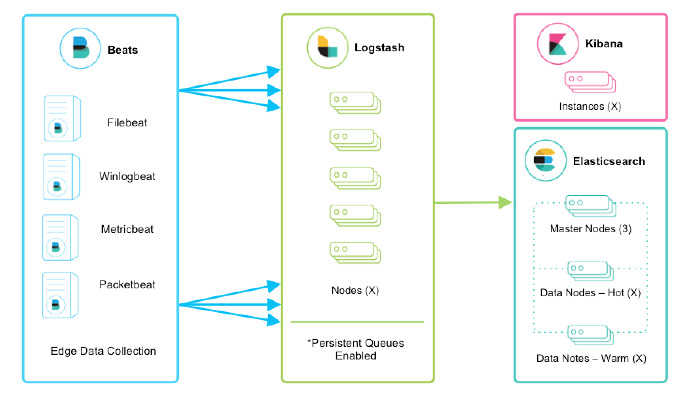

---
mapped_pages:
  - https://www.elastic.co/guide/en/logstash/current/deploying-and-scaling.html
---

# Deploying and scaling Logstash [deploying-and-scaling]

The Elastic Stack is used for a great variety of use cases, from operational log and metrics analytics, to enterprise and application search. Making sure your data gets scalably, durably, and securely transported to Elasticsearch is extremely important, especially for mission critical environments.

The goal of this document is to highlight the most common architecture patterns for Logstash and how to effectively scale as your deployment grows. The focus will be around the operational log, metrics, and security analytics use cases because they tend to require larger scale deployments. The deploying and scaling recommendations provided here may vary based on your own requirements.

## Getting Started [deploying-getting-started]

For first time users, if you simply want to tail a log file to grasp the power of the Elastic Stack, we recommend trying [Filebeat Modules](beats://reference/filebeat/filebeat-modules-overview.md). Filebeat Modules enable you to quickly collect, parse, and index popular log types and view pre-built Kibana dashboards within minutes. [Metricbeat Modules](beats://reference/metricbeat/metricbeat-modules.md) provide a similar experience, but with metrics data. In this context, Beats will ship data directly to Elasticsearch where [Ingest Nodes](docs-content://manage-data/ingest/transform-enrich/ingest-pipelines.md) will process and index your data.

### Introducing Logstash [_introducing_logstash]

What are the main benefits for integrating Logstash into your architecture?

* Scale through ingestion spikes - Logstash has an adaptive disk-based buffering system that will absorb incoming throughput, therefore mitigating backpressure
* Ingest from other data sources like databases, S3, or messaging queues
* Emit data to multiple destinations like S3, HDFS, or write to a file
* Compose more sophisticated processing pipelines with conditional dataflow logic

## Scaling Ingest [scaling-ingest]

Beats and Logstash make ingest awesome. Together, they provide a comprehensive solution that is scalable and resilient. What can you expect?

* Horizontal scalability, high availability, and variable load handling
* Message durability with at-least-once delivery guarantees
* End-to-end secure transport with authentication and wire encryption

### Beats and Logstash [_beats_and_logstash]

Beats run across thousands of edge host servers, collecting, tailing, and shipping logs to Logstash. Logstash serves as the centralized streaming engine for data unification and enrichment. The [Beats input plugin](logstash-docs-md://lsr/plugins-inputs-beats.md) exposes a secure, acknowledgement-based endpoint for Beats to send data to Logstash.

::::{note}
Enabling persistent queues is strongly recommended, and these architecture characteristics assume that they are enabled. We encourage you to review the [Persistent queues (PQ)](/reference/persistent-queues.md) documentation for feature benefits and more details on resiliency.
::::

### Scalability [_scalability]

Logstash is horizontally scalable and can form groups of nodes running the same pipeline. Logstash’s adaptive buffering capabilities will facilitate smooth streaming even through variable throughput loads. If the Logstash layer becomes an ingestion bottleneck, simply add more nodes to scale out. Here are a few general recommendations:

* Beats should [load balance](beats://reference/filebeat/elasticsearch-output.md#_loadbalance) across a group of Logstash nodes.
* A minimum of two Logstash nodes are recommended for high availability.
* It’s common to deploy just one Beats input per Logstash node, but multiple Beats inputs can also be deployed per Logstash node to expose independent endpoints for different data sources.

### Resiliency [_resiliency]

When using [Filebeat](https://www.elastic.co/products/beats/filebeat) or [Winlogbeat](https://www.elastic.co/products/beats/winlogbeat) for log collection within this ingest flow, **at-least-once delivery** is guaranteed. Both the communication protocols, from Filebeat or Winlogbeat to Logstash, and from Logstash to Elasticsearch, are synchronous and support acknowledgements. The other Beats don’t yet have support for acknowledgements.

Logstash persistent queues provide protection across node failures. For disk-level resiliency in Logstash, it’s important to ensure disk redundancy. For on-premise deployments, it’s recommended that you configure RAID. When running in the cloud or a containerized environment, it’s recommended that you use persistent disks with replication strategies that reflect your data SLAs.

::::{note}
Make sure `queue.checkpoint.writes: 1` is set for at-least-once guarantees. For more details, see the [persistent queue durability](/reference/persistent-queues.md#durability-persistent-queues) documentation.
::::

### Processing [_processing]

Logstash will commonly extract fields with [grok](logstash-docs-md://lsr/plugins-filters-grok.md) or [dissect](logstash-docs-md://lsr/plugins-filters-dissect.md), augment [geographical](logstash-docs-md://lsr/plugins-filters-geoip.md) info, and can further enrich events with [file](logstash-docs-md://lsr/plugins-filters-translate.md), [database](logstash-docs-md://lsr/plugins-filters-jdbc_streaming.md), or [Elasticsearch](logstash-docs-md://lsr/plugins-filters-elasticsearch.md) lookup datasets. Be aware that processing complexity can affect overall throughput and CPU utilization. Make sure to check out the other [available filter plugins](logstash-docs-md://lsr/filter-plugins.md).

### Secure Transport [_secure_transport]

Enterprise-grade security is available across the entire delivery chain.

* Wire encryption is recommended for both the transport from [Beats to Logstash](beats://reference/filebeat/configuring-ssl-logstash.md) and from [Logstash to Elasticsearch](/reference/secure-connection.md).
* There’s a wealth of security options when communicating with Elasticsearch including basic authentication, TLS, PKI, LDAP, AD, and other custom realms. To enable Elasticsearch security, see [Secure a cluster](docs-content://deploy-manage/security.md).

### Monitoring [_monitoring]

When running Logstash 5.2 or greater, the [Monitoring UI](https://www.elastic.co/products/x-pack/monitoring) provides deep visibility into your deployment metrics, helping observe performance and alleviate bottlenecks as you scale. Monitoring is an X-Pack feature under the Basic License and is therefore **free to use**. To get started, see [Monitoring Logstash](https://www.elastic.co/docs/api/doc/logstash/).

If external monitoring is preferred, there are [monitoring APIs](monitoring-logstash.md) that return point-in-time metrics snapshots.

## Adding Other Popular Sources [adding-other-sources]

Users may have other mechanisms of collecting logging data, and it’s easy to integrate and centralize them into the Elastic Stack. Let’s walk through a few scenarios:

### TCP, UDP, and HTTP Protocols [_tcp_udp_and_http_protocols]

The TCP, UDP, and HTTP protocols are common ways to feed data into Logstash. Logstash can expose endpoint listeners with the respective [TCP](logstash-docs-md://lsr/plugins-inputs-tcp.md), [UDP](logstash-docs-md://lsr/plugins-inputs-udp.md), and [HTTP](logstash-docs-md://lsr/plugins-inputs-http.md) input plugins. The data sources enumerated below are typically ingested through one of these three protocols.

::::{note}
The TCP and UDP protocols do not support application-level acknowledgements, so connectivity issues may result in data loss.
::::

For high availability scenarios, a third-party hardware or software load balancer, like HAProxy, should be added to fan out traffic to a group of Logstash nodes.

### Network and Security Data [_network_and_security_data]

Although Beats may already satisfy your data ingest use case, network and security datasets come in a variety of forms. Let’s touch on a few other ingestion points.

* Network wire data - collect and analyze network traffic with [Packetbeat](https://www.elastic.co/products/beats/packetbeat).
* Netflow v5/v9/v10 - Logstash understands data from Netflow/IPFIX exporters with the [Netflow codec](logstash-docs-md://lsr/plugins-codecs-netflow.md).
* Nmap - Logstash accepts and parses Nmap XML data with the [Nmap codec](logstash-docs-md://lsr/plugins-codecs-nmap.md).
* SNMP trap - Logstash has a native [SNMP trap input](logstash-docs-md://lsr/plugins-inputs-snmptrap.md).
* CEF - Logstash accepts and parses CEF data from systems like Arcsight SmartConnectors with the [CEF codec](logstash-docs-md://lsr/plugins-codecs-cef.md).

### Centralized Syslog Servers [_centralized_syslog_servers]

Existing syslog server technologies like rsyslog and syslog-ng generally send syslog over to Logstash TCP or UDP endpoints for extraction, processing, and persistence. If the data format conforms to RFC3164, it can be fed directly to the [Logstash syslog input](logstash-docs-md://lsr/plugins-inputs-syslog.md).

### Infrastructure & Application Data and IoT [_infrastructure_application_data_and_iot]

Infrastructure and application metrics can be collected with [Metricbeat](https://www.elastic.co/products/beats/metricbeat), but applications can also send webhooks to a Logstash HTTP input or have metrics polled from an HTTP endpoint with the [HTTP poller input plugin](logstash-docs-md://lsr/plugins-inputs-http_poller.md).

For applications that log with log4j2, it’s recommended to use the SocketAppender to send JSON to the Logstash TCP input. Alternatively, log4j2 can also log to a file for collection with FIlebeat. Usage of the log4j1 SocketAppender is not recommended.

IoT devices like Raspberry Pis, smartphones, and connected vehicles often send telemetry data through one of these protocols.

## Integrating with Messaging Queues [integrating-with-messaging-queues]

If you are leveraging message queuing technologies as part of your existing infrastructure, getting that data into the Elastic Stack is easy. For existing users who are utilizing an external queuing layer like Redis or RabbitMQ just for data buffering with Logstash, it’s recommended to use Logstash persistent queues instead of an external queuing layer. This will help with overall ease of management by removing an unnecessary layer of complexity in your ingest architecture.

For users who want to integrate data from existing Kafka deployments or require the underlying usage of ephemeral storage, Kafka can serve as a data hub where Beats can persist to and Logstash nodes can consume from.

The other TCP, UDP, and HTTP sources can persist to Kafka with Logstash as a conduit to achieve high availability in lieu of a load balancer. A group of Logstash nodes can then consume from topics with the [Kafka input](logstash-docs-md://lsr/plugins-inputs-kafka.md) to further transform and enrich the data in transit.

### Resiliency and Recovery [_resiliency_and_recovery]

When Logstash consumes from Kafka, persistent queues should be enabled and will add transport resiliency to mitigate the need for reprocessing during Logstash node failures. In this context, it’s recommended to use the default persistent queue disk allocation size `queue.max_bytes: 1GB`.

If Kafka is configured to retain data for an extended period of time, data can be reprocessed from Kafka in the case of disaster recovery and reconciliation.

### Other Messaging Queue Integrations [_other_messaging_queue_integrations]

Although an additional queuing layer is not required, Logstash can consume from a myriad of other message queuing technologies like [RabbitMQ](logstash-docs-md://lsr/plugins-inputs-rabbitmq.md) and [Redis](logstash-docs-md://lsr/plugins-inputs-redis.md). It also supports ingestion from hosted queuing services like [Pub/Sub](logstash-docs-md://lsr/plugins-inputs-google_pubsub.md), [Kinesis](logstash-docs-md://lsr/plugins-inputs-kinesis.md), and [SQS](logstash-docs-md://lsr/plugins-inputs-sqs.md).

