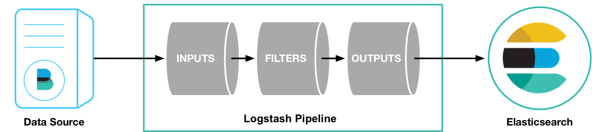

---
mapped_pages:
  - https://www.elastic.co/guide/en/logstash/current/first-event.html
---

# Stashing Your First Event [first-event]

First, let’s test your Logstash installation by running the most basic *Logstash pipeline*.

A Logstash pipeline has two required elements, `input` and `output`, and one optional element, `filter`. The input plugins consume data from a source, the filter plugins modify the data as you specify, and the output plugins write the data to a destination.



To test your Logstash installation, run the most basic Logstash pipeline.

**MacOS, Linux**

```sh
cd logstash-9.0.0
bin/logstash -e 'input { stdin { } } output { stdout {} }'
```

**Windows**

```sh
cd logstash-9.0.0
.\bin\logstash.bat -e "input { stdin { } } output { stdout {} }"
```

The command might vary slightly, depending on the terminal or shell you are using.

::::{note}
The location of the `bin` directory varies by platform. See [Directory layout](/reference/dir-layout.md) to find the location of `bin\logstash` on your system.
::::


::::{admonition} macOS Gatekeeper warnings
:class: important

Apple’s rollout of stricter notarization requirements affected the notarization of {{version.stack}} {{ls}} artifacts. If macOS Catalina displays a dialog when you first run {{ls}} that interrupts it, you will need to take an action to allow it to run. To prevent Gatekeeper checks on the {{ls}} files, run the following command on the downloaded `.tar.gz` archive or the directory to which was extracted:

```sh
xattr -d -r com.apple.quarantine <archive-or-directory>
```

For example, if the `.tar.gz` file was extracted to the default logstash-{{version.stack}} directory, the command is:

```sh subs=true
xattr -d -r com.apple.quarantine logstash-{{version.stack}}
```

Alternatively, you can add a security override if a Gatekeeper popup appears by following the instructions in the *How to open an app that hasn’t been notarized or is from an unidentified developer* section of [Safely open apps on your Mac](https://support.apple.com/en-us/HT202491).

::::


The `-e` flag enables you to specify a configuration directly from the command line. Specifying configurations at the command line lets you quickly test configurations without having to edit a file between iterations. The pipeline in the example takes input from the standard input, `stdin`, and moves that input to the standard output, `stdout`, in a structured format.

After starting Logstash, wait until you see "Pipeline main started" and then enter `hello world` at the command prompt:

```shell
hello world
2013-11-21T01:22:14.405+0000 0.0.0.0 hello world
```

Logstash adds timestamp and IP address information to the message. Exit Logstash by issuing a **CTRL-D** command in the shell where Logstash is running.

Congratulations! You’ve created and run a basic Logstash pipeline. Next, you learn how to create a more realistic pipeline.
