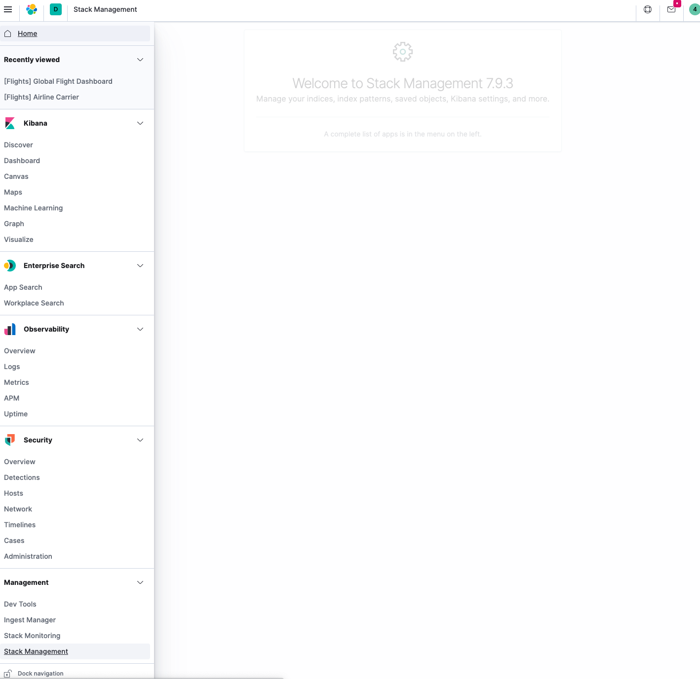

---
mapped_pages:
  - https://www.elastic.co/guide/en/logstash/current/logstash-centralized-pipeline-management.html
---

# Centralized Pipeline Management [logstash-centralized-pipeline-management]

The pipeline management feature centralizes the creation and management of Logstash configuration pipelines in {{kib}}.

::::{note}
Centralized pipeline management is a subscription feature. If you want to try the full set of features, you can activate a free 30-day trial. To view the status of your license, start a trial, or install a new license, open the {{kib}} main menu and click **Stack Management > License Management**. For more information, see [https://www.elastic.co/subscriptions](https://www.elastic.co/subscriptions) and [License Management](docs-content://deploy-manage/license/manage-your-license-in-self-managed-cluster.md).
::::

You can control multiple Logstash instances from the pipeline management UI in {{kib}}. You can add, edit, and delete pipeline configurations. On the Logstash side, you simply need to enable configuration management and register Logstash to use the centrally managed pipeline configurations.

::::{important}
After you configure {{ls}} to use centralized pipeline management, you can no longer specify local pipeline configurations. The `pipelines.yml` file and settings such as `path.config` and `config.string` are inactive when centralized pipeline management is enabled.
::::

## Manage pipelines [_manage_pipelines]

Before using the pipeline management UI, you must:

* [Configure centralized pipeline management](/reference/configuring-centralized-pipelines.md).
* If {{kib}} is protected with basic authentication, make sure your {{kib}} user has the `logstash_admin` role as well as the `logstash_writer` role that you created when you [configured Logstash to use basic authentication](/reference/secure-connection.md). Additionally, in order to view (as read-only) non-centrally-managed pipelines in the pipeline management UI, make sure your {{kib}} user has the `monitoring_user` role as well.

To manage Logstash pipelines in {{kib}}:

1. Open {{kib}} in your browser and go to the Management tab. If you’ve set up configuration management correctly, you’ll see an area for managing Logstash.

    

2. Click the **Pipelines** link.
3. To add a new pipeline, click **Create pipeline** and specify values.

    Pipeline ID
    :   A name that uniquely identifies the pipeline. This is the ID that you used when you [configured centralized pipeline management](/reference/configuring-centralized-pipelines.md) and specified a list of pipeline IDs in the `xpack.management.pipeline.id` setting.

    Description
    :   A description of the pipeline configuration. This information is for your use.

    Pipeline
    :   The pipeline configuration. You can treat the editor in the pipeline management UI like any other editor. You don’t have to worry about whitespace or indentation.

    Pipeline workers
    :   The number of parallel workers used to run the filter and output stages of the pipeline.

    Pipeline batch size
    :   The maximum number of events an individual worker thread collects before executing filters and outputs.

    Pipeline batch delay
    :   Time in milliseconds to wait for each event before sending an undersized batch to pipeline workers.

    Queue type
    :   The internal queueing model for event buffering. Options are **memory** for in-memory queueing, or **persisted** for disk-based acknowledged queueing.

    Queue max bytes
    :   The total capacity of the queue when persistent queues are enabled.

    Queue checkpoint writes
    :   The maximum number of events written before a checkpoint is forced when persistent queues are enabled.

### Pipeline behavior [_pipeline_behavior]

* The pipeline configurations and metadata are stored in Elasticsearch. Any changes that you make to a pipeline definition are picked up and loaded automatically by all Logstash instances registered to use the pipeline. The changes are applied immediately. If Logstash is registered to use the pipeline, you do not have to restart Logstash to pick up the changes.
* The pipeline runs on all Logstash instances that are registered to use the pipeline.  {{kib}} saves the new configuration, and Logstash will attempt to load it. There is no validation done at the UI level.
* You need to check the local Logstash logs for configuration errors. If you’re using the Logstash monitoring feature in {{kib}}, use the Monitoring tab to check the status of your Logstash nodes.
* You can specify multiple pipeline configurations that run in parallel on the same Logstash node.
* If you edit and save a pipeline configuration, Logstash reloads the configuration in the background and continues processing events.
* If you try to delete a pipeline that is running (for example, `apache`) in {{kib}}, Logstash will attempt to stop the pipeline. Logstash waits until all events have been fully processed by the pipeline. Before you delete a pipeline, make sure you understand your data sources. Stopping a pipeline may lead to data loss.

