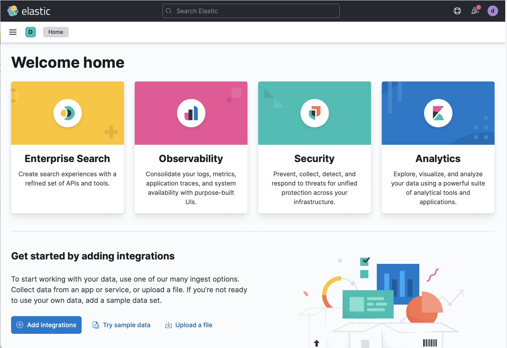
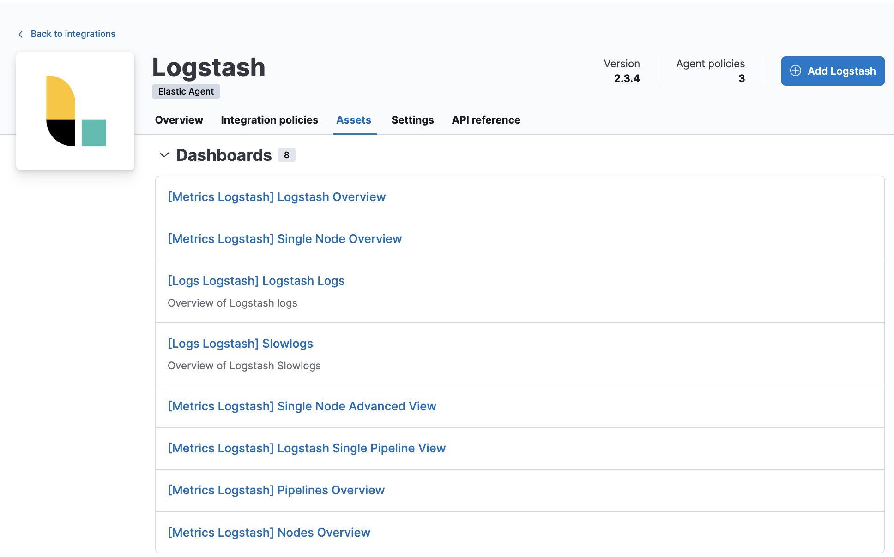

# Collect {{ls}} monitoring data for stack monitoring [monitoring-with-elastic-agent]


{{agent}} collects monitoring data from your {{ls}} instance and sends it directly to your monitoring cluster. With {{agent}} collection the monitoring agent remains active even if the {{ls}} instance does not.

You can enroll {{agent}} in [{{fleet}}](docs-content://reference/fleet/install-fleet-managed-elastic-agent.md) for management from a central location, or you can run [{{agent}} standalone](docs-content://reference/fleet/install-standalone-elastic-agent.md).

**Prerequisites**

Complete these steps as you prepare to collect and ship monitoring data for stack monitoring:

::::{dropdown} Set up {{es}} monitoring
:name: set-up-monitoring-ea

To bind {{ls}} metrics to an {{es}} cluster, set up [{{es}} monitoring](docs-content://deploy-manage/monitor/stack-monitoring.md). If you would like to create a dedicated monitoring cluster (optional), check out [{{es}} monitoring documentation](docs-content://deploy-manage/monitor/stack-monitoring/elasticsearch-monitoring-self-managed.md).

::::


::::{dropdown} Disable default collection of {{ls}} monitoring metrics
:name: disable-default-include-ea

Set `monitoring.enabled` to `false` in logstash.yml to disable default collection:

```yaml
monitoring.enabled: false
```

::::


::::{dropdown} Specify the target cluster_uuid (optional)
:name: define-cluster__uuid-ea

To bind the metrics of {{ls}} to a specific cluster, optionally define the `monitoring.cluster_uuid` in the configuration file (logstash.yml):

```yaml
monitoring.cluster_uuid: PRODUCTION_ES_CLUSTER_UUID
```

::::


::::{dropdown} Grant agent access to Elasticsearch (standalone agent only)
:name: create-user-ea

Minimal permissions required to send Logstash monitoring data to Elasticsearch:

* `monitor` cluster privilege
* `auto_configure` and `create_doc` index privileges on `logs-*` and `metrics-*` indices.

See [Grant standalone Elastic Agents access to Elasticsearch](docs-content://reference/fleet/grant-access-to-elasticsearch.md)

::::


## Install and configure {{agent}} [install-and-configure-mon]

When you have completed the prerequisites, install and configure {{agent}} to monitor host logs and metrics. We’ll walk you through the process in these steps:

* [Add the {{agent}} {{ls}} integration](#add-logstash-integration-ea)
* [Install and run an {{agent}} on your machine](#add-agent-to-fleet-ea)
* [View assets](#view-assets)
* [Monitor {{ls}} logs and metrics (Stack Monitoring)](#view-data-stack)

Check out [Installing {{agent}}](docs-content://reference/fleet/install-elastic-agents.md) in the *Fleet and Elastic Agent Guide* for more info.


### Add the {{agent}} {{ls}} integration [add-logstash-integration-ea]

1. Go to the {{kib}} home page, and click **Add integrations**.

    % TO DO: Use `:class: screenshot`
    

2. In the query bar, search for **{{ls}}** and select the integration to see more details about it.
3. Click **Add {{ls}}**.
4. Configure the integration name and optionally add a description.
5. Configure the integration to collect logs.

    * Make sure that **Logs** is turned on if you want to collect logs from your {{ls}} instance, ensuring that the required settings are correctly configured:
    * Under **Logs**, modify the log paths to match your {{ls}} environment.

6. Configure the integration to collect metrics

    ::::{tip}
    For the best experience with Stack Monitoring, we recommend collecting both `node` and `node_stats`. Turning off either of these will result in incomplete or missing visualizations.
    ::::

    * Make sure that **Metrics (Stack Monitoring)** is turned on, and **Metrics (Elastic Agent)** is turned off, if you want to collect metrics from your {{ls}} instance.
    * Under **Metrics (Stack Monitoring)**, make sure the hosts setting points to your {{ls}} host URLs. By default, the integration collects {{ls}} monitoring metrics from `localhost:9600`. If that host and port number are not correct, update the `hosts` setting. If you configured {{ls}} to use encrypted communications, you must access it via HTTPS. For example, use a `hosts` setting like `https://localhost:9600`.

7. Choose where to add the integration policy.<br> Click **New hosts** to add it to new agent policy or **Existing hosts** to add it to an existing agent policy.
8. In the popup, click **Add {{agent}} to your hosts** to open the **Add agent** flyout.

    ::::{tip}
    If you accidentally close the popup, go to **{{fleet}} > Agents**, then click **Add agent** to access the flyout.
    ::::


### Install and run an {{agent}} on your machine [add-agent-to-fleet-ea]

The **Add agent** flyout has two options: **Enroll in {{fleet}}** and **Run standalone**. Enrolling agents in {{fleet}} (default) provides a centralized management tool in {{kib}}, reducing management overhead.

:::::::{tab-set}

::::::{tab-item} Fleet-managed
1. When the **Add Agent flyout** appears, stay on the **Enroll in fleet** tab.
2. Skip the **Select enrollment token** step. The enrollment token you need is already selected.

    ::::{note}
    The enrollment token is specific to the {{agent}} policy that you just created. When you run the command to enroll the agent in {{fleet}}, you will pass in the enrollment token.
    ::::

3. Download, install, and enroll the {{agent}} on your host by selecting your host operating system and following the **Install {{agent}} on your host** step.

It takes about a minute for {{agent}} to enroll in {{fleet}}, download the configuration specified in the policy you just created, and start collecting data.
::::::

::::::{tab-item} Run standalone
1. When the **Add Agent flyout** appears, navigate to the **Run standalone** tab.
2. Configure the agent. Follow the instructions in **Install Elastic Agent on your host**.
3. After unpacking the binary, replace the `elastic-agent.yml` file with that supplied in the Add Agent flyout on the "Run standalone" tab, replacing the values of `ES_USERNAME` and `ES_PASSWORD` appropriately.
4. Run `sudo ./elastic-agent install`
::::::

:::::::

## View assets [view-assets]

After you have confirmed enrollment and data is coming in,  click **View assets** to access dashboards related to the {{ls}} integration.

For traditional Stack Monitoring UI, the dashboards marked **[Logs {{ls}}]** are used to visualize the logs produced by your {{ls}} instances, with those marked **[Metrics {{ls}}]** for metrics dashboards. These are populated with data only if you selected the **Metrics (Elastic Agent)** checkbox.

% TO DO: Use `:class: screenshot`


A number of dashboards are included to view {{ls}} as a whole, and dashboards that allow you to drill-down into how {{ls}} is performing on a node, pipeline and plugin basis.


### Monitor {{ls}} logs and metrics (Stack Monitoring) [view-data-stack]

[View the monitoring data in {{kib}}](docs-content://deploy-manage/monitor/stack-monitoring/kibana-monitoring-data.md), and navigate to the [monitoring UI](/reference/logstash-monitoring-ui.md).
