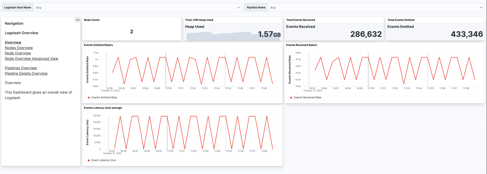

# Collect {{ls}} monitoring data for dashboards ({{serverless-short}}) [serverless-monitoring-with-elastic-agent]


{{ls}} monitoring is available on {{serverless-full}} through the [{{ls}} Integration](https://github.com/elastic/integrations/blob/main/packages/logstash/_dev/build/docs/README.md) in [Elastic Observability](docs-content://solutions/observability.md). {{agent}} collects monitoring data from your {{ls}} instance, sends it directly to {{serverless-full}}, and shows the data in {{ls}} dashboards.

You’ll need to have an [Elastic Observability](docs-content://solutions/observability.md) project. We’ll provide steps to help you create one.

**Prerequisite**

::::{dropdown} Disable default collection of {{ls}} monitoring metrics
:name: disable-default-svrless

Set `monitoring.enabled` to `false` in logstash.yml to disable default collection:

```yaml
monitoring.enabled: false
```

::::


## Add and configure the {{ls}} integration [setup-project]

**Add the {{ls}} integration**

1. Log in to your [cloud.elastic.co](https://cloud.elastic.co/) account and create an Observability serverless project.
2. Select **Get Started** from the main menu.
3. Select **Start exploring** (near the bottom of the page).
4. On the **Integrations** page, search for **{{ls}}** and select it to see details.
5. Click **Add {{ls}}**.
6. Follow the instructions to install {{agent}} and add the {{ls}} integration.

For more info, check out the [Elastic Observability](docs-content://solutions/observability.md) docs.

**Configure the integration to collect logs**

* Make sure that **Logs** is ON if you want to collect logs from your {{ls}} instance. Check the settings to be sure that they are configured correctly.
* Modify the log paths to match your {{ls}} environment.

**Configure the integration to collect metrics**

::::{tip}
For the best experience with the Logstash dashboards, we recommend collecting all of the metrics. Turning off metrics will result in incomplete or missing visualizations.
::::

* Make sure that **Metrics (Elastic Agent)** is turned on (default), and **Metrics (Stack Monitoring)** is turned off.
* Set the {{ls}} URL to point to your {{ls}} instance.<br> By default, the integration collects {{ls}} monitoring metrics from `https://localhost:9600`. If that host and port number are not correct, update the `Logstash URL` setting. If you configured {{ls}} to use encrypted communications and/or a username and password, you must access it using HTTPS. Expand the **Advanced Settings** options, and fill in the appropriate values for your {{ls}} instance.


## View assets [view-assets-esvrless]

1. Go to **Project settings → Integrations** to see your **Installed integrations**.
2. Select the {{ls}} integration, and then select **Assets** to access dashboards for the {{ls}} integration.


## Monitor {{ls}} logs and metrics [view-data-svrless]

From the list of assets, open the **[Metrics {{ls}}] {{ls}} overview** dashboard to view overall performance. Then follow the navigation panel to further drill down into {{ls}} performance.

% TO DO: Use `:class: screenshot`


You can hover over any visualization to adjust its settings, or click the **Edit** button to make changes to the dashboard. To learn more, refer to [Dashboard and visualizations](docs-content://explore-analyze/dashboards.md).
