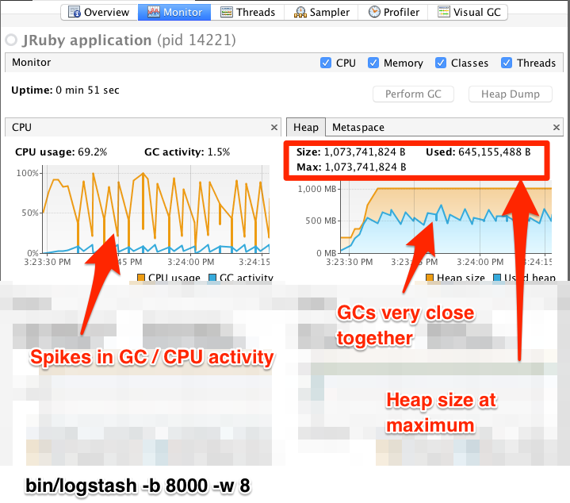
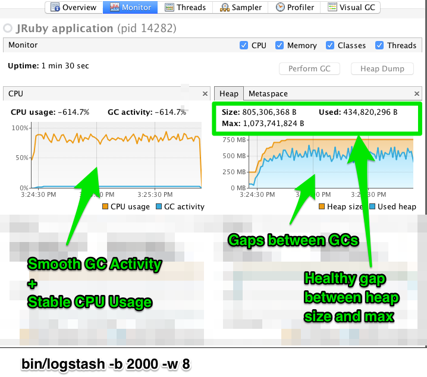

---
mapped_pages:
  - https://www.elastic.co/guide/en/logstash/current/tuning-logstash.html
---

# Tuning and profiling logstash pipeline performance [tuning-logstash]

The [Flow Metrics](https://www.elastic.co/docs/api/doc/logstash/operation/operation-nodestats) in Logstash’s Monitoring API can provide excellent insight into how events are flowing through your pipelines. They can reveal whether your pipeline is constrained for resources, which parts of your pipeline are consuming the most resources, and provide useful feedback when tuning.

## Worker utilization [tuning-logstash-worker-utilization]

When a pipeline’s `worker_utilization` flow metric is consistently near 100, all of its workers are occupied processing the filters and outputs of the pipeline. We can see *which* plugins in the pipeline are consuming the available worker capacity by looking at the plugin-level `worker_utilization` and `worker_millis_per_event` flow metrics. Using this information, we can gain intuition about how to tune the pipeline’s settings to add resources, how to find and eliminate wasteful computation, or realize the need to scale up/out the capacity of downstream destinations.

In general, plugins fit into one of two categories:

* **CPU-bound**: plugins that perform computation on the contents of events *without* the use of the network or disk IO tend to benefit from incrementally increasing `pipeline.workers` as long as the process has available CPU; once CPU is exhausted additional concurrency can result in *lower* throughput as the pipeline workers contend for resources and the amount of time spent in context-switching increases.
* **IO-bound**: plugins that use the network to either enrich events or transmit events tend to benefit from incrementally increasing `pipeline.workers` and/or tuning the `pipeline.batch.*` parameters described below. This allows them to make better use of network resources, as long as those external services are not exerting back-pressure (even if Logstash is using nearly all of its available CPU).

The further a pipeline’s `worker_utilization` is from 100, the more time its workers are spending waiting for events to arrive in the queue. Because the volume of data in most pipelines is often inconsistent, the goal should be to tune the pipeline such that it has the resources to avoid propagating back-pressure to its inputs during peak periods.

## Queue back-pressure [tuning-logstash-queue-backpressure]

When a pipeline receives events faster than it can process them, the inputs eventually experience back-pressure that prevents them from receiving additional events. Depending on the input plugin being used, back-pressure can either propagate upstream or lead to data loss.

A pipeline’s `queue_backpressure` flow metric reflects how much time the inputs are spending attempting to push events into the queue. The metric isn’t precisely comparable across pipelines, but instead allows you to compare a single pipeline’s current behaviour to *itself* over time. When this metric is growing, look *downstream* at the pipeline’s filters and outputs to see if they are using resources effectively, have sufficient resources allocated, or are experiencing back-pressure of their own.

::::{note}
A persisted queue offers durability guarantees and can absorb back-pressure for longer than the default in-memory queue, but once it is full it too propagates back-pressure. The `queue_persisted_growth_events` flow metric is useful measure of how much back-pressure is being actively absorbed by the persisted queue, and should trend toward zero (or less) over the pipeline’s lifetime. Negative numbers indicate that the queue is *shrinking*, and that the workers are catching up on lag that had previously developed.
::::

## Tuning-related settings [tuning-logstash-settings]

The Logstash defaults are chosen to provide fast, safe performance for most users. However if you notice performance issues, you may need to modify some of the defaults. Logstash provides the following configurable options for tuning pipeline performance: `pipeline.workers`, `pipeline.batch.size`, and `pipeline.batch.delay`.

For more information about setting these options, see [logstash.yml](/reference/logstash-settings-file.md).

Make sure you’ve read the [Performance troubleshooting](/reference/performance-troubleshooting.md) before modifying these options.

* The `pipeline.workers` setting determines how many threads to run for filter and output processing. If you find that events are backing up, or that the CPU is not saturated, consider increasing the value of this parameter to make better use of available processing power. Good results can even be found increasing this number past the number of available processors as these threads may spend significant time in an I/O wait state when writing to external systems.
* The `pipeline.batch.size` setting defines the maximum number of events an individual worker thread collects from the queue before attempting to execute filters and outputs. Larger batch sizes are generally more efficient, but increase memory overhead. Output plugins can process each batch as a logical unit. The Elasticsearch output, for example, attempts to send a single [bulk request](https://www.elastic.co/docs/api/doc/elasticsearch/operation/operation-bulk) for each batch received. Tuning the `pipeline.batch.size` setting adjusts the size of bulk requests sent to Elasticsearch.
* The `pipeline.batch.max_output_size` setting defines how many events in a batch are sent together to the outputs. Some pipeline filters can increase the memory size of a batch by multiplying the number of events or by increasing the size of individual events. This setting can be used to split a batch into chunks sent to the outputs and thus mitigate some Out of Memory errors.
* The `pipeline.batch.delay` setting rarely needs to be tuned. This setting adjusts the latency of the Logstash pipeline. Pipeline batch delay is the maximum amount of time in milliseconds that a pipeline worker waits for each new event while its current batch is not yet full. After this time elapses without any more events becoming available, the worker begins to execute filters and outputs. The maximum time that the worker waits between receiving an event and processing that event in a filter is the product of the `pipeline.batch.delay` and `pipeline.batch.size` settings.

## Notes on pipeline configuration and performance [_notes_on_pipeline_configuration_and_performance]

If you plan to modify the default pipeline settings, take into account the following suggestions:

* The total number of inflight events is determined by the product of the  `pipeline.workers` and `pipeline.batch.size` settings. This product is referred to as the *inflight count*. Keep the value of the inflight count in mind as you adjust the `pipeline.workers` and `pipeline.batch.size` settings. Pipelines that intermittently receive large events at irregular intervals require sufficient memory to handle these spikes. Set the JVM heap space accordingly in the `jvm.options` config file (See [Logstash Configuration Files](/reference/config-setting-files.md) for more info).
* {applies_to}`stack: preview 9.2.0` Consider enabling the metering of batch sizes using the setting `pipeline.batch.metrics.sampling_mode` to help you understand the actual batch sizes being processed by your pipeline. This setting can be useful tuning the `pipeline.batch.size` setting. For more details see [logstash.yml](/reference/logstash-settings-file.md).
* Measure each change to make sure it increases, rather than decreases, performance.
* Ensure that you leave enough memory available to cope with a sudden increase in event size. For example, an application that generates exceptions that are represented as large blobs of text.
* The number of workers may be set higher than the number of CPU cores since outputs often spend idle time in I/O wait conditions.
* Threads in Java have names and you can use the `jstack`, `top`, and the VisualVM graphical tools to figure out which resources a given thread uses.
* On Linux platforms, Logstash labels its threads with descriptive names. For example, inputs show up as `[base]<inputname`, and pipeline workers show up as `[base]>workerN`, where N is an integer. Where possible, other threads are also labeled to help you identify their purpose.

## Profiling the heap [profiling-the-heap]

When tuning Logstash you may have to adjust the heap size. You can use the [VisualVM](https://visualvm.github.io/) tool to profile the heap. The **Monitor** pane in particular is useful for checking whether your heap allocation is sufficient for the current workload. The screenshots below show sample **Monitor** panes. The first pane examines a Logstash instance configured with too many inflight events. The second pane examines a Logstash instance configured with an appropriate amount of inflight events. Note that the specific batch sizes used here are most likely not applicable to your specific workload, as the memory demands of Logstash vary in large part based on the type of messages you are sending.

% TO DO: Use `:class: screenshot`

% TO DO: Use `:class: screenshot`

In the first example we see that the CPU isn’t being used very efficiently. In fact, the JVM is often times having to stop the VM for “full GCs”. Full garbage collections are a common symptom of excessive memory pressure. This is visible in the spiky pattern on the CPU chart. In the more efficiently configured example, the GC graph pattern is more smooth, and the CPU is used in a more uniform manner. You can also see that there is ample headroom between the allocated heap size, and the maximum allowed, giving the JVM GC a lot of room to work with.

Examining the in-depth GC statistics with a tool similar to the excellent [VisualGC](https://visualvm.github.io/plugins.html) plugin shows that the over-allocated VM spends very little time in the efficient Eden GC, compared to the time spent in the more resource-intensive Old Gen “Full” GCs.

::::{note}
As long as the GC pattern is acceptable, heap sizes that occasionally increase to the maximum are acceptable. Such heap size spikes happen in response to a burst of large events passing through the pipeline. In general practice, maintain a gap between the used amount of heap memory and the maximum. This document is not a comprehensive guide to JVM GC tuning. Read the official [Oracle guide](http://www.oracle.com/webfolder/technetwork/tutorials/obe/java/gc01/index.html) for more information on the topic. We also recommend reading [Debugging Java Performance](https://www.semicomplete.com/blog/geekery/debugging-java-performance/).
::::

