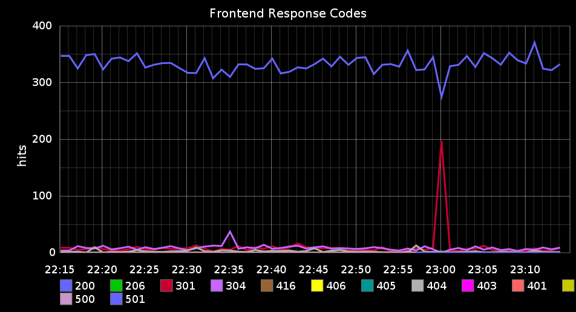

# Pull metrics from logs

Logs are more than just text. How many customers signed up today? How many HTTP
errors happened this week? When was your last puppet run?

Apache logs give you the http response code and bytes sent - that's useful in a
graph. Metrics occur in logs so frequently there are piles of tools available to
help process them.

Logstash can help (and even replace some tools you might already be using).

## Example: Replacing Etsy's Logster

[Etsy](https://github.com/etsy) has some excellent open source tools. One of
them, [logster](https://github.com/etsy/logster), is meant to help you pull
metrics from logs and ship them to [graphite](http://graphite.wikidot.com/) so
you can make pretty graphs of those metrics.

One sample logster parser is one that pulls http response codes out of your
apache logs: [SampleLogster.py](https://github.com/etsy/logster/blob/master/logster/parsers/SampleLogster.py)

The above code is roughly 50 lines of python and only solves one specific
problem in only apache logs: count http response codes by major number (1xx,
2xx, 3xx, etc). To be completely fair, you could shrink the code required for
a Logster parser, but size is not strictly the point, here.

## Keep it simple

Logstash can do more than the above, simpler, and without much coding skill:

    input {
      file { 
        path => "/var/log/apache/access.log" 
        type => "apache-access"
      }
    }

    filter {
      grok { 
        type => "apache-access"
        pattern => "%{COMBINEDAPACHELOG}" 
      }
    }

    output {
      statsd { 
        # Count one hit every event by response
        increment => "apache.response.%{response}" 
      }
    }

The above uses grok to parse fields out of apache logs and using the statsd
output to increment counters based on the response code. Of course, now that we
are parsing apache logs fully, we can trivially add additional metrics:

    output {
      statsd {
        # Count one hit every event by response
        increment => "apache.response.%{response}"

        # Use the 'bytes' field from the apache log as the count value.
        count => [ "apache.bytes", "%{bytes}" ]
      }
    }

Now adding additional metrics is just one more line in your logstash config
file. BTW, the 'statsd' output writes to another Etsy tool,
[statsd](https://github.com/etsy/statsd), which helps build counters/latency
data and ship it to graphite for graphing.

Using the logstash config above and a bunch of apache access requests, you might end up
with a graph that looks like this:

The point made above is not "logstash is better than Logster" - the point is
that logstash is a general-purpose log management and pipelining tool and that
while you can centralize logs with logstash, you can read, modify, and write
them to and from just about anywhere.

## A full use case

TODO(sissel): include sample logs, show custom grok format, output to statsd and/or graphite.
